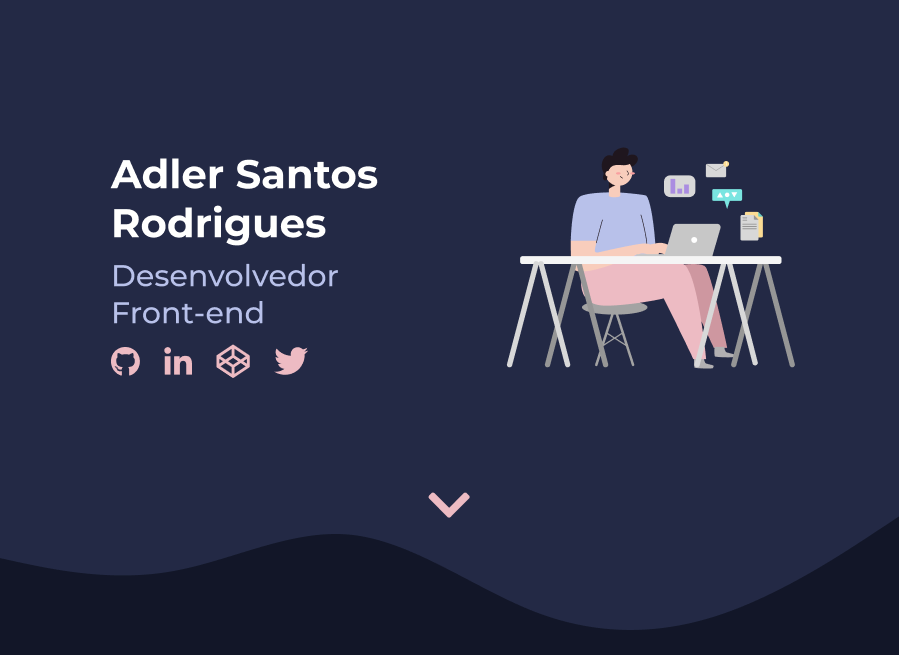

 

 
  <a href="#install">Instalação</a> • <a href="#features">Funcionalidades</a> • <a href="#techs">Tecnologias</a> • <a href="#result">Resultado</a> • <a href="#autor">Autor</a>      

<h1 align="center">Portfólio Adler Rodrigues</h1>

Portfólio construido para exibir meus projetos criados durante a minha jornada de estudos na área de desenvolvimento web.

<h4 align="center"> 
	⚠️Projeto em construção⚠️
</h4>

<h3 id="install">Instalação</h3> 

Esse projeto não precisa ser instalado, basta clicar <a href="http://adler.dev.br/">nesse link</a> para acessar o site.

<h3 id="features">Funcionalidades</h3> 

- [x] Tela inicial
- [x] Sobre mim
- [x] Projetos
- [x] Contatos
- [ ] Enviar email com os dados do formulário

<h3 id="techs">Tecnologias</h3>

- [Javascript](https://developer.mozilla.org/pt-BR/docs/Web/JavaScript)
- [HTML](https://developer.mozilla.org/pt-BR/docs/Web/HTML)
- [CSS](https://developer.mozilla.org/pt-BR/docs/Web/CSS)

<h3 id="result">Resultado</h3>

  

<h3 id="autor">Autor</h3>

<a href="http://adler.dev.br/">
 
  
<b>Feito com ❤️ por Adler Rodrigues</b>
</a>

  
